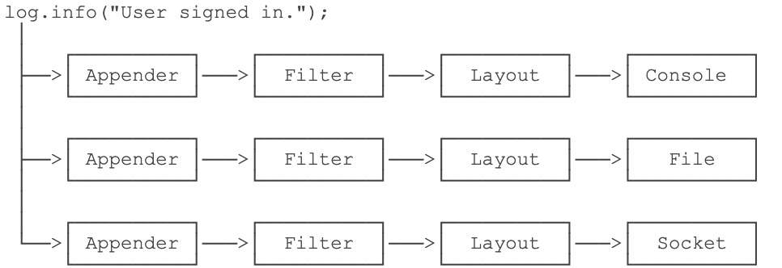

# Common-logging（日志接口）

Commons Logging的特色是，它可以挂接不同的日志系统，并通过配置文件指定挂接的日志系统。默认情况下，Commons Loggin自动搜索并使用Log4j（Log4j是另一个流行的日志系统），如果没有找到Log4j，再使用JDK Logging。

## 使用

使用Commons Logging只需要和两个类打交道，并且只有两步：

第一步，通过`LogFactory`获取`Log`类的实例； 第二步，使用`Log`实例的方法打日志。

```java

import org.apache.commons.logging.Log;
import org.apache.commons.logging.LogFactory;
public class Main {
    public static void main(String[] args) {
        Log log = LogFactory.getLog(Main.class);
        log.info("start...");
        log.warn("end.");
    }
}

```

### 在静态方法中使用

一般定义一个静态类型变量

```java
// 在静态方法中引用Log:
public class Main {
    static final Log log = LogFactory.getLog(Main.class);

    static void foo() {
        log.info("foo");
    }
}
```

### 在实例方法中使用Log

通常定义一个实例变量

```java
// 在实例方法中引用Log:
public class Person {
    //使用getClass()方法，子类可以直接使用该log实例
    protected final Log log = LogFactory.getLog(getClass());

    void foo() {
        log.info("foo");
    }
}
```

### 好用的重载方法

```java
info(String, Throwable)
  try {
    ...
} catch (Exception e) {
    log.error("got exception!", e);
}
```

# Log4j(日志实现)

Commons Logging作为日志接口使用，真正的日志实现可以使用Log4j



当我们使用Log4j输出一条日志时，Log4j自动通过不同的Appender把同一条日志输出到不同的目的地

上述结构虽然复杂，但我们在实际使用的时候，并不需要关心Log4j的API，而是通过配置文件来配置它。

以XML配置为例，使用Log4j的时候，我们把一个`log4j2.xml`的文件放到`classpath`下就可以让Log4j读取配置文件并按照我们的配置来输出日志。下面是一个配置文件的例子：

```xml
<?xml version="1.0" encoding="UTF-8"?>
<Configuration>
	<Properties>
        <!-- 定义日志格式 -->
		<Property name="log.pattern">%d{MM-dd HH:mm:ss.SSS} [%t] %-5level %logger{36}%n%msg%n%n</Property>
        <!-- 定义文件名变量 -->
		<Property name="file.err.filename">log/err.log</Property>
		<Property name="file.err.pattern">log/err.%i.log.gz</Property>
	</Properties>
    <!-- 定义Appender，即目的地 -->
	<Appenders>
        <!-- 定义输出到屏幕 -->
		<Console name="console" target="SYSTEM_OUT">
            <!-- 日志格式引用上面定义的log.pattern -->
			<PatternLayout pattern="${log.pattern}" />
		</Console>
        <!-- 定义输出到文件,文件名引用上面定义的file.err.filename -->
		<RollingFile name="err" bufferedIO="true" fileName="${file.err.filename}" filePattern="${file.err.pattern}">
			<PatternLayout pattern="${log.pattern}" />
			<Policies>
                <!-- 根据文件大小自动切割日志 -->
				<SizeBasedTriggeringPolicy size="1 MB" />
			</Policies>
            <!-- 保留最近10份 -->
			<DefaultRolloverStrategy max="10" />
		</RollingFile>
	</Appenders>
	<Loggers>
		<Root level="info">
            <!-- 对info级别的日志，输出到console -->
			<AppenderRef ref="console" level="info" />
            <!-- 对error级别的日志，输出到err，即上面定义的RollingFile -->
			<AppenderRef ref="err" level="error" />
		</Root>
	</Loggers>
</Configuration>
```

另外把下面三个库放到classpath

- log4j-api-2.x.jar
- log4j-core-2.x.jar   log4j-api和log4j-core的jar包使用相当于原先使用一个log4j的jar包，
- log4j-jcl-2.x.jar(Jakarta Commons-logging / Apache Commons Logging）提供统一的接口，而使用其它组件的实现

因为Commons Logging会自动发现并使用Log4j，所以，把上一节下载的`commons-logging-1.2.jar`也放到`classpath`中。

要打印日志，只需要按Commons Logging的写法写，不需要改动任何代码，就可以得到Log4j的日志输出

## 最佳实践

在开发阶段，始终使用Commons Logging接口来写入日志，并且开发阶段无需引入Log4j。如果需要把日志写入文件， 只需要把正确的配置文件和Log4j相关的jar包放入`classpath`，就可以自动把日志切换成使用Log4j写入，无需修改任何代码。


# log4j2

## 日志框架

### 日志接口(slf4j)

slf4j即简单日志门面（Simple Logging Facade for Java）是对所有日志框架制定的一种规范、标准、接口，不能直接使用。

Jakarta Commons-logging（JCL）是apache最早提供的日志的门面接口。提供简单的日志实现以及日志解耦功能。（现在名称是 Apache Commons-logging），其实现默认是jdk自带的日志组件Jdk14Logger

### 日志实现(log4j、logback、log4j2)

g4j是apache实现的一个开源日志组件
logback同样是由log4j的作者设计完成的，拥有更好的特性，用来取代log4j的一个日志框架，是slf4j的原生实现
log4j2是log4j 1.x和logback的改进版，据说采用了一些新技术（无锁异步、等等），多线程下，异步日志的吞吐量是og4j 1.x的18倍，性能更高，并解决了一些死锁的bug，而且配置更加简单灵活。(采用自动模块，不仅仅只是实现)
原文链接：https://blog.csdn.net/qq_40182873/article/details/87777709

## log4j到log4j2的大变化

log4j是一个jar包，接口和实现都是在一起的，log4j2的接口和实现是分开的


# slf4j和logback

slf4j用来代替Commons Logging，Logback用来代替Log4j。

我们先来看看SLF4J对Commons Logging的接口有何改进。在Commons Logging中，我们要打印日志，有时候得这么写：

```java
int score = 99;
p.setScore(score);
log.info("Set score " + score + " for Person " + p.getName() + " ok.");
```

拼字符串是一个非常麻烦的事情，所以SLF4J的日志接口改进成这样了：

```java
int score = 99;
p.setScore(score);
logger.info("Set score {} for Person {} ok.", score, p.getName());
```

我们靠猜也能猜出来，SLF4J的日志接口传入的是一个带占位符的字符串，用后面的变量自动替换占位符，所以看起来更加自然。

如何使用SLF4J？它的接口实际上和Commons Logging几乎一模一样：

```java
import org.slf4j.Logger;
import org.slf4j.LoggerFactory;

class Main {
    final Logger logger = LoggerFactory.getLogger(getClass());
}
```

对比一下Commons Logging和SLF4J的接口：

| Commons Logging                       | SLF4J                   |
| :------------------------------------ | :---------------------- |
| org.apache.commons.logging.Log        | org.slf4j.Logger        |
| org.apache.commons.logging.LogFactory | org.slf4j.LoggerFactory |

使用SLF4J和Logback和前面讲到的使用Commons Logging加Log4j是类似的，先分别下载[SLF4J](https://www.slf4j.org/download.html)和[Logback](https://logback.qos.ch/download.html)，然后把以下jar包放到classpath下：

- slf4j-api-1.7.x.jar
- logback-classic-1.2.x.jar  改善了log4j,自身实现了SLF4j API
- logback-core-1.2.x.jar

然后使用SLF4J的Logger和LoggerFactory即可。和Log4j类似，我们仍然需要一个Logback的配置文件，把`logback.xml`放到classpath下，配置如下：

```xml
<?xml version="1.0" encoding="UTF-8"?>
<configuration>

	<appender name="CONSOLE" class="ch.qos.logback.core.ConsoleAppender">
		<encoder>
			<pattern>%d{HH:mm:ss.SSS} [%thread] %-5level %logger{36} - %msg%n</pattern>
		</encoder>
	</appender>

	<appender name="FILE" class="ch.qos.logback.core.rolling.RollingFileAppender">
		<encoder>
			<pattern>%d{HH:mm:ss.SSS} [%thread] %-5level %logger{36} - %msg%n</pattern>
			<charset>utf-8</charset>
		</encoder>
		<file>log/output.log</file>
		<rollingPolicy class="ch.qos.logback.core.rolling.FixedWindowRollingPolicy">
			<fileNamePattern>log/output.log.%i</fileNamePattern>
		</rollingPolicy>
		<triggeringPolicy class="ch.qos.logback.core.rolling.SizeBasedTriggeringPolicy">
			<MaxFileSize>1MB</MaxFileSize>
		</triggeringPolicy>
	</appender>

	<root level="INFO">
		<appender-ref ref="CONSOLE" />
		<appender-ref ref="FILE" />
	</root>
</configuration>
```


# 参考

https://www.iteye.com/blog/dongdong9223-1853868

